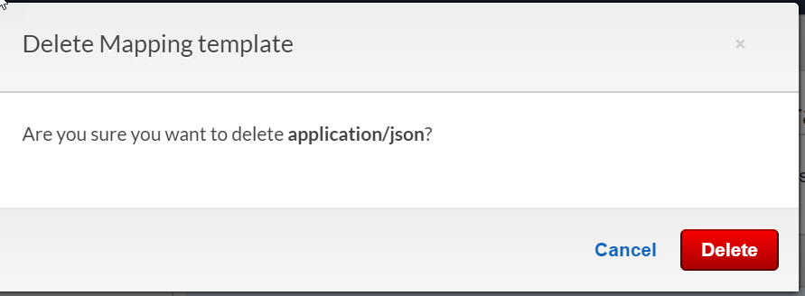
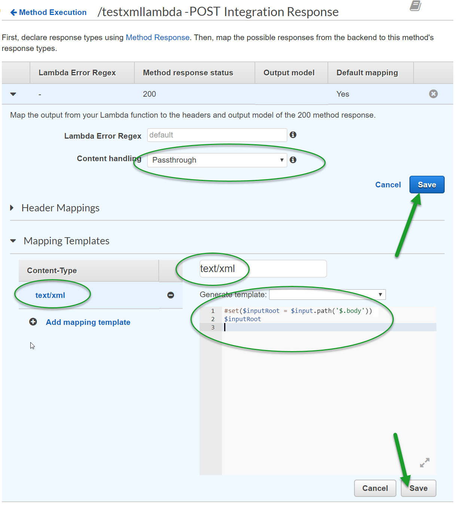

# How to use Lambda and API Gateway to consume XML instead of JSON

In this lab I will guide you through the process of creating an API with AWS API Gateway and Lambda to consume an XML body and response with an XML body, without the need the use JSON in your request or response.

**Note:** internally JSON is still used to wrap the payload and request going to and coming from Lambda. But the API Gateway endpoint consumes pure XML.

## Prerequisites 

- an active AWS account with a role that has permissions create **Lambda functions** and an API in **API Gateway**.
- [cURL](https://curl.haxx.se/ "cURL") or [Postman](https://www.getpostman.com/) to test the API once deployed 

## Background Info

Most of the Lambda functions you may have written and connected to an API in API Gateway probably only consume JSON payloads. After all, the content-type ``application/json`` is the default when you write your API Gateway Mapping Template and VTL (Apache Velocity Template Language).

However, this does not mean you can't write a Lambda function that consumes other content-types such as binary data or (SOAP) XML. In this lab we'll show you how to implement a Lambda function and API Gateway to consume and return a dummy SOAP XML.

## Executive Summary

This set up involves customizing the configuration of the following 3 phases of the request in API Gateway:

* **Integration Request**

	* Adding two **Mapping Templates** ``application/xml`` and ``text/xml`` with VTL: ``{"body" : $input.json('$')}``

* **Integration Response**

	* Delete ``application/json`` from **Mapping Templates**
	* Enable **Content handling** ``Passthrough``
	* Add ``text/xml`` as new **Mapping Template** with VTL: ``#set($inputRoot = $input.path('$.body')); $inputRoot``

* **Method Response**

	* Remove Response Model ``Empty`` for Content-Type ``application/json`` for **HTTP Status 200**
	* Add Response Model ``Empty``  for Content-Type ``application/soap+xml``   

And, applying the following changes to your **Lambda function**:

* Change handler interface to: ``exports.handler =  (event, context, callback)``
* Add the following code block before returning the reponse:

		var resp = {
	    	statusCode: 200,
	        headers: {
	        	'Content-Type': 'text/xml'
			},
	        body: xmlString	
		}
	            
	    callback(null, resp) 

## Step 1. Create a Lambda function that consumes XML inside of a JSON body

Please, navigate to the **Lambda** page of the AWS console in the region of your choice (for instance ``us-west-2``): [https://console.aws.amazon.com/lambda/home?#/functions](https://console.aws.amazon.com/lambda/home?#/functions)

Then, click **Create**.

Then, provide a name for your Lambda function, such as ``testxmllambda``.

Then, make sure **Node.js** is selected as **Runtime** (any version will do).

Then, click **Create Function**.

Then, select **Upload a .zip file** from the **Code entry type** drop down list.

Make sure **Node.js** is selected as **Runtime**.

Then, click **Upload** and upload the following ZIP file: [./Source/Lambda/Lambda.zip](./Source/Lambda/Lambda.zip)

**Note:** The only reason we have to upload our sample code instead of using the inline editor in this lab is because we are referencing an external module ``xml2js`` to proof we can actually parse the SOAP XML inside the Lambda function as an XML document.

The  [./Source/Lambda/Lambda.zip](./Source/Lambda/Lambda.zip) file contains the following ``index.js`` which serves as the handler of the Lambda function:
		
	// Let's use the xml2js package to parse our incoming XML to proof we have a proper XML document to work with in Lamda
	var xml2js = require('xml2js');
	// Added 2020-04-10: added a library to turn JSON into an XML string again after we added an attribute (just to prove we are working with XML)
	var jsonxml = require('jsontoxml');

	// Some default settings needed by xml2js. We can leave the as they are.
	var options = {           // options passed to xml2js parser
	explicitCharkey: false, // undocumented
	trim: false,            // trim the leading/trailing whitespace from text nodes
	normalize: false,       // trim interior whitespace inside text nodes
	explicitRoot: false,    // return the root node in the resulting object?
	emptyTag: null,         // the default value for empty nodes
	explicitArray: true,    // always put child nodes in an array
	ignoreAttrs: false,     // ignore attributes, only create text nodes
	mergeAttrs: false,      // merge attributes and child elements
	validator: null         // a callable validator
	};

	// Let's change the default handler interface to the following "old" style notation so we have more control with the callback function
	exports.handler =  (event, context, callback) => {

		// Let's create an instance of our xml2js parser
		var parser = new xml2js.Parser(options);
		// Retrieve the XML from the JSON body that API Gateway is sending because of this Method Execution VTL: { "body" : $input.json('$') }
		// Note: So, yes, internally API gateway still uses JSON to wrap around our XML to send it to Lambda. But, the JSON is never visibile to the sender of the API request or the consumer of the response.
		var xml = event.body;

		// Let's turn the XML into a Javascript object
		parser.parseString(xml, function (err, result) {

		// If something went wrong, the callback first argument contains the error object that will be sent to API gateway
			if (err!=null) {
			callback(err, null);
			} else {

			// For this example, we are expecting an XML request payload in the form of:
						
			// <?xml version="1.0"?>
			// <catalog>
			//    <book id="bk101">
			//       <author>Gambardella, Matthew</author>
			//       <title>XML Developer's Guide</title>
			//       <genre>Computer</genre>
			//       <price>44.95</price>
			//       <publish_date>2000-10-01</publish_date>
			//       <description>An in-depth look at creating applications 
			//       with XML.</description>
			//    </book>
			//    <book id="bk102">
			//       <author>Ralls, Kim</author>
			//       <title>Midnight Rain</title>
			//       <genre>Fantasy</genre>
			//       <price>5.95</price>
			//       <publish_date>2000-12-16</publish_date>
			//       <description>A former architect battles corporate zombies, 
			//       an evil sorceress, and her own childhood to become queen 
			//       of the world.</description>
			//    </book>
			//    <book id="bk103">
			//       <author>Corets, Eva</author>
			//       <title>Maeve Ascendant</title>
			//       <genre>Fantasy</genre>
			//       <price>5.95</price>
			//       <publish_date>2000-11-17</publish_date>
			//       <description>After the collapse of a nanotechnology 
			//       society in England, the young survivors lay the 
			//       foundation for a new society.</description>
			//    </book>
			//    <book id="bk104">
			//       <author>Corets, Eva</author>
			//       <title>Oberon's Legacy</title>
			//       <genre>Fantasy</genre>
			//       <price>5.95</price>
			//       <publish_date>2001-03-10</publish_date>
			//       <description>In post-apocalypse England, the mysterious 
			//       agent known only as Oberon helps to create a new life 
			//       for the inhabitants of London. Sequel to Maeve 
			//       Ascendant.</description>
			//    </book>
			//    <book id="bk105">
			//       <author>Corets, Eva</author>
			//       <title>The Sundered Grail</title>
			//       <genre>Fantasy</genre>
			//       <price>5.95</price>
			//       <publish_date>2001-09-10</publish_date>
			//       <description>The two daughters of Maeve, half-sisters, 
			//       battle one another for control of England. Sequel to 
			//       Oberon's Legacy.</description>
			//    </book>
			//    <book id="bk106">
			//       <author>Randall, Cynthia</author>
			//       <title>Lover Birds</title>
			//       <genre>Romance</genre>
			//       <price>4.95</price>
			//       <publish_date>2000-09-02</publish_date>
			//       <description>When Carla meets Paul at an ornithology 
			//       conference, tempers fly as feathers get ruffled.</description>
			//    </book>
			//    <book id="bk107">
			//       <author>Thurman, Paula</author>
			//       <title>Splish Splash</title>
			//       <genre>Romance</genre>
			//       <price>4.95</price>
			//       <publish_date>2000-11-02</publish_date>
			//       <description>A deep sea diver finds true love twenty 
			//       thousand leagues beneath the sea.</description>
			//    </book>
			//    <book id="bk108">
			//       <author>Knorr, Stefan</author>
			//       <title>Creepy Crawlies</title>
			//       <genre>Horror</genre>
			//       <price>4.95</price>
			//       <publish_date>2000-12-06</publish_date>
			//       <description>An anthology of horror stories about roaches,
			//       centipedes, scorpions  and other insects.</description>
			//    </book>
			//    <book id="bk109">
			//       <author>Kress, Peter</author>
			//       <title>Paradox Lost</title>
			//       <genre>Science Fiction</genre>
			//       <price>6.95</price>
			//       <publish_date>2000-11-02</publish_date>
			//       <description>After an inadvertant trip through a Heisenberg
			//       Uncertainty Device, James Salway discovers the problems 
			//       of being quantum.</description>
			//    </book>
			//    <book id="bk110">
			//       <author>O'Brien, Tim</author>
			//       <title>Microsoft .NET: The Programming Bible</title>
			//       <genre>Computer</genre>
			//       <price>36.95</price>
			//       <publish_date>2000-12-09</publish_date>
			//       <description>Microsoft's .NET initiative is explored in 
			//       detail in this deep programmer's reference.</description>
			//    </book>
			//    <book id="bk111">
			//       <author>O'Brien, Tim</author>
			//       <title>MSXML3: A Comprehensive Guide</title>
			//       <genre>Computer</genre>
			//       <price>36.95</price>
			//       <publish_date>2000-12-01</publish_date>
			//       <description>The Microsoft MSXML3 parser is covered in 
			//       detail, with attention to XML DOM interfaces, XSLT processing, 
			//       SAX and more.</description>
			//    </book>
			//    <book id="bk112">
			//       <author>Galos, Mike</author>
			//       <title>Visual Studio 7: A Comprehensive Guide</title>
			//       <genre>Computer</genre>
			//       <price>49.95</price>
			//       <publish_date>2001-04-16</publish_date>
			//       <description>Microsoft Visual Studio 7 is explored in depth,
			//       looking at how Visual Basic, Visual C++, C#, and ASP+ are 
			//       integrated into a comprehensive development 
			//       environment.</description>
			//    </book>
			// </catalog>          
			
			// Now, send a dummy XML string back, but add an XML attribute of the incoming request so we proof that the incoming request was actually parsed as an XML document
			// Modified 2020-04-10: added jsonxml() method to actually convert the JSON object back to an XML string!
			result.book[0]["newAttribute"] = "test";
			// Take the first book and return that to show we added a new attribute, and to show that we can return an XML string as an XML content-type
			var xmlString = jsonxml(result.book[0], {
				xmlHeader: true
			});     

			// Now prepare the response object
			var resp = {
				// Return this as a successful "200" response
				statusCode: 200,
				headers: {
					// Note: This Content-Type corresponds to the Content-Type added as Mapping Template in the Integration Response of the API in API Gateway
					'Content-Type': 'text/xml'
				},
				// Note: This body attribute is what the text/xml Mapping Template of the Integration Response refers to when it executes the following VTL:
				
				// #set($inputRoot = $input.path('$.body'))
				// $inputRoot

				body: xmlString
			}
			
			// Now, call the callback with the response above
			callback(null, resp)
				
			}
		});

	};

Then, click **Save**

## Step 2. Test our Lambda function

Now, click the **Test** button.

Then, provide an **Event name** for your test event, such as ``Test``.

Copy & paste the following test request body into the inline text editor:

	{ "body": "<?xml version=\"1.0\" encoding=\"UTF-8\"?><catalog><book id=\"bk101\"><author>Gambardella, Matthew</author><title>XML Developer's Guide</title><genre>Computer</genre><price>44.95</price><publish_date>2000-10-01</publish_date><description>An in-depth look at creating applications with XML.</description></book><book id=\"bk102\"><author>Ralls, Kim</author><title>Midnight Rain</title><genre>Fantasy</genre><price>5.95</price><publish_date>2000-12-16</publish_date><description>A former architect battles corporate zombies, an evil sorceress, and her own childhood to become queen of the world.</description></book><book id=\"bk103\"><author>Corets, Eva</author><title>Maeve Ascendant</title><genre>Fantasy</genre><price>5.95</price><publish_date>2000-11-17</publish_date><description>After the collapse of a nanotechnology society in England, the young survivors lay the foundation for a new society.</description></book><book id=\"bk104\"><author>Corets, Eva</author><title>Oberon's Legacy</title><genre>Fantasy</genre><price>5.95</price><publish_date>2001-03-10</publish_date><description>In post-apocalypse England, the mysterious agent known only as Oberon helps to create a new life for the inhabitants of London. Sequel to Maeve Ascendant.</description></book><book id=\"bk105\"><author>Corets, Eva</author><title>The Sundered Grail</title><genre>Fantasy</genre><price>5.95</price><publish_date>2001-09-10</publish_date><description>The two daughters of Maeve, half-sisters, battle one another for control of England. Sequel to Oberon's Legacy.</description></book><book id=\"bk106\"><author>Randall, Cynthia</author><title>Lover Birds</title><genre>Romance</genre><price>4.95</price><publish_date>2000-09-02</publish_date><description>When Carla meets Paul at an ornithology conference, tempers fly as feathers get ruffled.</description></book><book id=\"bk107\"><author>Thurman, Paula</author><title>Splish Splash</title><genre>Romance</genre><price>4.95</price><publish_date>2000-11-02</publish_date><description>A deep sea diver finds true love twenty thousand leagues beneath the sea.</description></book><book id=\"bk108\"><author>Knorr, Stefan</author><title>Creepy Crawlies</title><genre>Horror</genre><price>4.95</price><publish_date>2000-12-06</publish_date><description>An anthology of horror stories about roaches, centipedes, scorpions and other insects.</description></book><book id=\"bk109\"><author>Kress, Peter</author><title>Paradox Lost</title><genre>Science Fiction</genre><price>6.95</price><publish_date>2000-11-02</publish_date><description>After an inadvertant trip through a Heisenberg Uncertainty Device, James Salway discovers the problems of being quantum.</description></book><book id=\"bk110\"><author>O'Brien, Tim</author><title>Microsoft .NET: The Programming Bible</title><genre>Computer</genre><price>36.95</price><publish_date>2000-12-09</publish_date><description>Microsoft's .NET initiative is explored in detail in this deep programmer's reference.</description></book><book id=\"bk111\"><author>O'Brien, Tim</author><title>MSXML3: A Comprehensive Guide</title><genre>Computer</genre><price>36.95</price><publish_date>2000-12-01</publish_date><description>The Microsoft MSXML3 parser is covered in detail, with attention to XML DOM interfaces, XSLT processing, SAX and more.</description></book><book id=\"bk112\"><author>Galos, Mike</author><title>Visual Studio 7: A Comprehensive Guide</title><genre>Computer</genre><price>49.95</price><publish_date>2001-04-16</publish_date><description>Microsoft Visual Studio 7 is explored in depth, looking at how Visual Basic, Visual C++, C#, and ASP+ are integrated into a comprehensive development environment.</description></book></catalog>" }

**Note:** Notice how **we are using JSON here** even though we claimed not use JSON for the request or the response. This is because we will be using **API Gateway** later to get rid of the JSON and **work with pure XML for both our request payload as well as the response body**.

After the test event has been created, click **Test** again.

Now, scroll down to the **Execution Results** tab of the **Function code** section.

You should see the following output:
	
	Response:
	{
	  "statusCode": 200,
	  "headers": {
	    "Content-Type": "text/xml"
	  },
	  "body": "<?xml version=\"1.0\" encoding=\"utf-8\"?><$><id>bk101</id></$><author>Gambardella, Matthew</author><title>XML Developer's Guide</title><genre>Computer</genre><price>44.95</price><publish_date>2000-10-01</publish_date><description>An in-depth look at creating applications with XML.</description><newAttribute>test</newAttribute>"
	}

Notice how the XML element was taken from the original XML request, with a new attribute added:

	<$><id>bk101</id></$>
	<author>Ralls, Kim</author>
	<title>Midnight Rain</title>
	<genre>Fantasy</genre>
	<price>5.95</price>
	<publish_date>2000-12-16</publish_date>
	<description>A former architect battles corporate zombies, 
	an evil sorceress, and her own childhood to become queen 
	of the world.</description>
	<newAttribute>test</newAttribute>

This confirms that we successfully parsed the XML document that we used for testing the Lambda function.

## Step 3. Create the API in API Gateway

Now, navigate to the API Gateway page of the AWS Console: [https://console.aws.amazon.com/apigateway/home?#/apis](https://console.aws.amazon.com/apigateway/home?#/apis)

Then, click **Create API**

Then, provide a **Name** for your API, such as ``XMLLambda``

Then, click **Create API**

Now, select **Create Resource** from the **Actions** drop down list.

Then, provide a **Resource Name**, such as ``testxmllambda``

Then, select **Enable API Gateway CORS**.

Then, click **Create Resource**.

Then, select **Create Method** from the **Actions** drop down list.

Then, select **POST** from the **tiny drop down list** and click on the even tinier **checkmark icon** next to it.

Then, type the name of the **Lambda Function** you created earlier, such as ``testxmllambda``.

Then, click **Save** 

Then, click **OK**

## Step 4. Configure Integration Request

### Step 4.1. Apply Mapping Template for ``application/xml``

Then, click on **Integration Request**

Expand **Mapping Templates**.

Then, click **Add mapping template**.

Then, type ``application/xml`` 

**Note:** notice how we are diverting from the default here and are entering ``application/xml`` instead of ``application/json``

Then, **click the tiny checkmark icon** next to it.

Then, click **Yes, secure this integration**

Then, add the following VTL in the text editor:

	{"body" : $input.json('$')}

And, click **Save**. 

### Step 4.2. Apply Mapping Template for ``text/xml``

Now, scroll up and click **Add mapping template** and type ``text/xml`` and repeat the exact same step as Step 4.1 by adding the following VTL code block to the text editor:

	{"body" : $input.json('$')}

Then, click **Save**

## Step 5. Configure Integration Response

Now, go back to the **Method Execution** page and click **Integration Response**.

Now, next to ``application/json`` click the tiny delete icon.

Next, click **Delete**.

Now, click **Add mapping template**.

Then, type ``text/xml`` as **Content-Type** and click the tiny checkmark icon.

Then, copy and paste the following VTL code block in the text editor:

	#set($inputRoot = $input.path('$.body')); 
	$inputRoot
  
Then, click **Save** at the bottom AND then click **Save again** at the top.

## Step 6. Configure Method Response

Now, go back to the **Method Execution** page and click **Integration Response**.

Then, click **Method Response**.

Then, expand the **HTTP Status 200**

Then, click the **delete icon** next to ``application/json``

Then, click **Add Response Model**.

Then, enter ``application/soap+xml`` as **Content type**.

Next, select **Empty** from the **Models** drop down list.

Then, click the tiny checkmark icon.

## Step 6. Deploy your API

Now, select **Deploy API** from the **Actions** drop down list.

Then, if this is your first deployment, go ahead and create a new stage with name ``DEV``

Then, click **Deploy**.

Then, copy the endpoint URL at the top of the page, for instance:

	https://abcdefgh.execute-api.us-west-2.amazonaws.com/DEV

So our complete API endpoint URL becomes:

	https://abcdefgh.execute-api.us-west-2.amazonaws.com/DEV/testxmllambda

## Step 7. Test your XML API in AWS API Gateway

Now, enter the following cURL statement in a Window CMD prompt or bash:

	curl -i -X POST -H "Content-Type: application/xml"  -d "<?xml version=\"1.0\" encoding=\"UTF-8\"?><catalog><book id=\"bk101\"><author>Gambardella, Matthew</author><title>XML Developer's Guide</title><genre>Computer</genre><price>44.95</price><publish_date>2000-10-01</publish_date><description>An in-depth look at creating applications with XML.</description></book><book id=\"bk102\"><author>Ralls, Kim</author><title>Midnight Rain</title><genre>Fantasy</genre><price>5.95</price><publish_date>2000-12-16</publish_date><description>A former architect battles corporate zombies, an evil sorceress, and her own childhood to become queen of the world.</description></book><book id=\"bk103\"><author>Corets, Eva</author><title>Maeve Ascendant</title><genre>Fantasy</genre><price>5.95</price><publish_date>2000-11-17</publish_date><description>After the collapse of a nanotechnology society in England, the young survivors lay the foundation for a new society.</description></book><book id=\"bk104\"><author>Corets, Eva</author><title>Oberon's Legacy</title><genre>Fantasy</genre><price>5.95</price><publish_date>2001-03-10</publish_date><description>In post-apocalypse England, the mysterious agent known only as Oberon helps to create a new life for the inhabitants of London. Sequel to Maeve Ascendant.</description></book><book id=\"bk105\"><author>Corets, Eva</author><title>The Sundered Grail</title><genre>Fantasy</genre><price>5.95</price><publish_date>2001-09-10</publish_date><description>The two daughters of Maeve, half-sisters, battle one another for control of England. Sequel to Oberon's Legacy.</description></book><book id=\"bk106\"><author>Randall, Cynthia</author><title>Lover Birds</title><genre>Romance</genre><price>4.95</price><publish_date>2000-09-02</publish_date><description>When Carla meets Paul at an ornithology conference, tempers fly as feathers get ruffled.</description></book><book id=\"bk107\"><author>Thurman, Paula</author><title>Splish Splash</title><genre>Romance</genre><price>4.95</price><publish_date>2000-11-02</publish_date><description>A deep sea diver finds true love twenty thousand leagues beneath the sea.</description></book><book id=\"bk108\"><author>Knorr, Stefan</author><title>Creepy Crawlies</title><genre>Horror</genre><price>4.95</price><publish_date>2000-12-06</publish_date><description>An anthology of horror stories about roaches, centipedes, scorpions and other insects.</description></book><book id=\"bk109\"><author>Kress, Peter</author><title>Paradox Lost</title><genre>Science Fiction</genre><price>6.95</price><publish_date>2000-11-02</publish_date><description>After an inadvertant trip through a Heisenberg Uncertainty Device, James Salway discovers the problems of being quantum.</description></book><book id=\"bk110\"><author>O'Brien, Tim</author><title>Microsoft .NET: The Programming Bible</title><genre>Computer</genre><price>36.95</price><publish_date>2000-12-09</publish_date><description>Microsoft's .NET initiative is explored in detail in this deep programmer's reference.</description></book><book id=\"bk111\"><author>O'Brien, Tim</author><title>MSXML3: A Comprehensive Guide</title><genre>Computer</genre><price>36.95</price><publish_date>2000-12-01</publish_date><description>The Microsoft MSXML3 parser is covered in detail, with attention to XML DOM interfaces, XSLT processing, SAX and more.</description></book><book id=\"bk112\"><author>Galos, Mike</author><title>Visual Studio 7: A Comprehensive Guide</title><genre>Computer</genre><price>49.95</price><publish_date>2001-04-16</publish_date><description>Microsoft Visual Studio 7 is explored in depth, looking at how Visual Basic, Visual C++, C#, and ASP+ are integrated into a comprehensive development environment.</description></book></catalog>" https://abcdefgh.execute-api.us-west-2.amazonaws.com/DEV/testxmllambda

Or, download and execute the supplied Windows CMD files for your convenience:

* [runxml.cmd](./Source/cURL/runxml.cmd) to execute a cURL statement with a prepared sample XML payload

* [runxmlfile.cmd](./Source/cURL/runxmlfile.cmd) to execute a cURL statement with a payload read from a corresponding XML file payload: [request.xml](./Source/cURL/request.xml) 
* The expected response from our test API in XML form is located here: [exptectedresponse.xml](./Source/cURL/exptectedresponse.xml)

Or, paste the XML body from [request.xml](./Source/cURL/request.xml)  into a Postman API call.

Then, the result we should see appear is the following:
	
	HTTP/1.1 200 OK
	Date: Thu, 10 Oct 2019 17:42:13 GMT
	Content-Type: application/soap+xml
	Content-Length: 2422
	Connection: keep-alive
	x-amzn-RequestId: 1070e31e-132c-4ef7-a10f-7abb81f5bd13
	x-amz-apigw-id: BW4KSHPePHcFaDg=
	X-Amzn-Trace-Id: Root=1-5d9f6d74-ce4acd82061fc4b4bca80e06;Sampled=0
	
	;
	<?xml version="1.0" encoding="utf-8"?><$><id>bk101</id></$><author>Gambardella, Matthew</author><title>XML Developer's Guide</title><genre>Computer</genre><price>44.95</price><publish_date>2000-10-01</publish_date><description>An in-depth look at creating applications with XML.</description><newAttribute>test</newAttribute> 

And there we have it, if you look closely you can see not only a proper XML response, but also part of the parsed XML request payload:
	
	<$><id>bk101</id></$>
	<author>Ralls, Kim</author>
	<title>Midnight Rain</title>
	<genre>Fantasy</genre>
	<price>5.95</price>
	<publish_date>2000-12-16</publish_date>
	<description>A former architect battles corporate zombies, 
	an evil sorceress, and her own childhood to become queen 
	of the world.</description>
	<newAttribute>test</newAttribute>

**Note:** notice how are both our request payload and reponse body are actual XML objects with a proper ``xml`` content-type.

## Conclusion

In this lab we showed you how you can create an API with AWS API Gateway and Lambda to consume an XML body, without the use of JSON.

## Contributors ##

| Roles											 | Author(s)										 |
| ---------------------------------------------- | ------------------------------------------------- |
| Lab Manuals									 | Manfred Wittenbols @mwittenbols					 |

## Version history ##

| Version | Date          		| Comments        |
| ------- | ------------------- | --------------- |
| 1.0     | Oct 9, 2019   | Initial release |
| 1.1     | April 10, 2020   | Bugfix, as the sample wasn't working properly. Thanks to Ramesh Patel |

## Disclaimer ##
**THIS CODE IS PROVIDED *AS IS* WITHOUT WARRANTY OF ANY KIND, EITHER EXPRESS OR IMPLIED, INCLUDING ANY IMPLIED WARRANTIES OF FITNESS FOR A PARTICULAR PURPOSE, MERCHANTABILITY, OR NON-INFRINGEMENT.**

